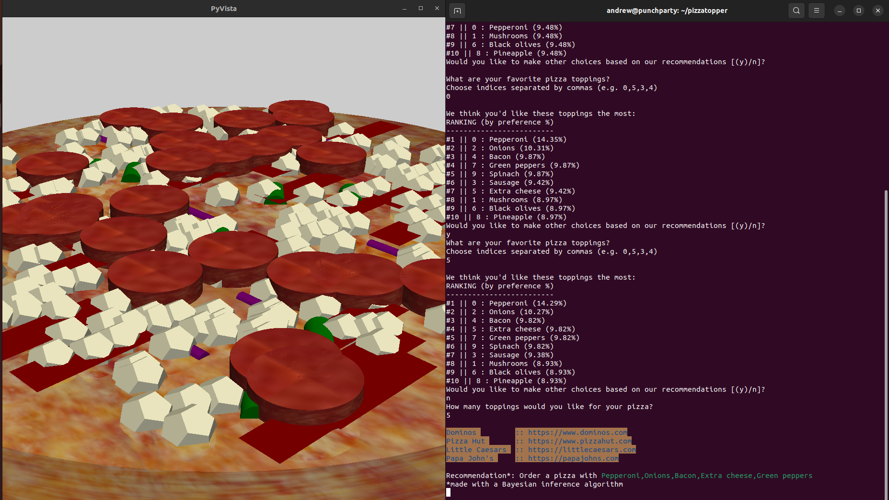

# pizzatopper

PizzaTopper: A reference to "pizza" and "topper" indicating the software's ability to find the best toppings for your pizza.

My practice on Bayesian inference programming and ChatGPT-facilitated code development. 

## Usage

```ruby 
virtualenv venv
source venv/bin/activate
pip install -r requirements.in
python script.py
```




